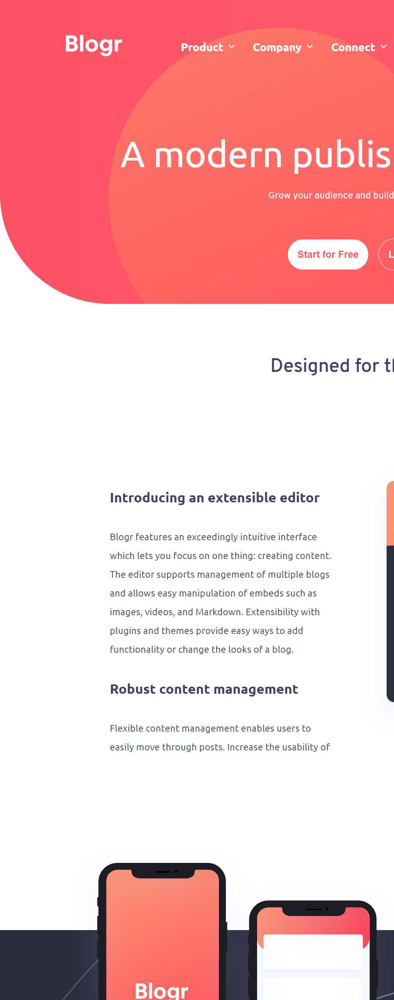

# Blogr landing page{

This is a solution to the [Blogr landing page challenge on Frontend Mentor](https://www.frontendmentor.io/challenges/blogr-landing-page-EX2RLAApP). Frontend Mentor challenges help you improve your coding skills by building realistic projects.
}

## Table of contents
- [Overview](#overview)
  - [Screenshot](#screenshot)
  - [Links](#links)
- [My process](#my-process)
  - [Built with](#built-with)
  - [What I learned](#what-i-learned)
  - [Useful resources](#useful-resources)

## Overview

### Screenshot

### Links

- Live Site URL: https://flamboyant-shirley-09ef60.netlify.app

## My process

### Built with

- Semantic HTML5 markup
- BEM html Model
- CSS custom properties
- SCSS 
- Flexbox
- Mobile-first workflow
- Javascript

### What I learned

I Used Bem html model for structure of the html which also helped with the structure of scss.

I learned to keep the mobile and desktop navbars html structure the same, because then i can use the same
logic in javascript.

This made me polish my skills.

Building out the design mobile first, reinforced me to preplan how the flex direction works,
and it also forced me to use more landmark html tags for containing the content, for accesibility.

### Useful resources

background-size and positioning: https://www.w3schools.com/cssref/css3_pr_background-size.asp
                                 https://www.w3schools.com/cssref/pr_background-position.asp

